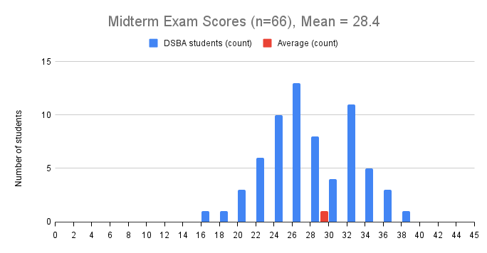

# 06026213 Big Data Systems

This repo consists of teaching materials (lectures and code examples) for 3rd year DSBA students at IT KMITL

## Contact

Main Contact via TA
Urgency Contact: sirasit.lo@kmitl.ac.th

## Course Outlines
|Week| Date | Lecture Slides|Lab Sheet|
|---|---|---|---|
|Week 01| 25/11/2025 | [Week1_Introduction](https://github.com/noswolf/BDS/blob/main/Week1/BDS_Week1.pdf)  | - |
|Week 02| 02/12/2025 | - | - |   
|Week 03| 09/12/2025 | [Week3_HDFS_and_MapReduce](https://github.com/noswolf/BDS/blob/main/Week3/BDS_Week3.pdf)|   |  
|Week 04| 16/12/2025 | | |     
|Week 05| 23/12/2025 | | [Lab2_DataFrame](https://github.com/noswolf/BDS/blob/main/Week5/BDS_Lab2_student.ipynb)|  
|Week 06| 30/12/2025 |  - | - |   
|Week 07| 06/01/2026 |  [Week7_Apache_Spark](https://github.com/noswolf/BDS/blob/main/Week7/BDS_Week7.pdf)| [Lab3_RDD](https://github.com/noswolf/BDS/blob/main/Week7/BDS_Lab3_student.ipynb) |  
|Week 08| 13/01/2026 |  No class (due to Commencement Ceremony) | - |  
|Week --| 23/01/2026 | Mid-term | |  
|Week 09| 27/01/2026 | [Week9_Databricks](https://github.com/noswolf/BDS/blob/main/Week9/BDS_Week9.pdf) | [Lab4_PySpark](https://github.com/noswolf/BDS/blob/main/Week9/BDS_Lab4_student.ipynb) |   
|Week 10| 03/02/2026 | [Week10_Lakeflow_SDP](https://github.com/noswolf/BDS/blob/main/Week10/BDS_Week10.pdf) | [Lab5_Custom_Data_Sources](https://github.com/noswolf/BDS/blob/main/Week10/BDS_Lab5_student.ipynb)   [Lab6_Lakeflow_SDP](https://github.com/noswolf/BDS/blob/main/Week10/BDS_Lab6_student.ipynb) |  
|Week 11| 10/02/2026 | No Class due to grading midterm exams krub, apologies to all :( | |    
|Week 12| 17/02/2026 | [Week12_LDP_Fundamentals](https://github.com/noswolf/BDS/blob/main/Week12/BDS_Week12.pdf) | [Lab7_LDP_using_CDC](https://github.com/noswolf/BDS/blob/main/Week12/BDS_Lab7_student.ipynb) | 
|Week 13| 24/02/2026 | [Week13_] |   |  
|Week 14| 03/03/2026 | Public Holiday | - |  
|Week 15| 10/03/2026 | [Week15_] |  |
|Final Exam| 19/03/2026 |  |		|

## Midterm Distribution Scores
